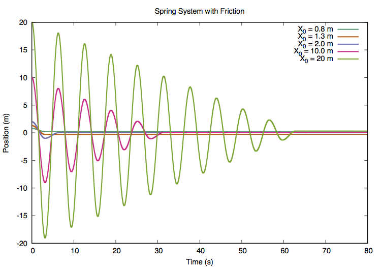

# Spring Simulation
<center>

<center/>
### Modeling a harmonic system with Coulomb Friction
This is a simple example of the numerical euler stepping method to solving
differential equations. It has been designed for educational use in
computational physics courses. 
#### Usage
```
>> SPRING SIMULATION

>> PARAMETERS:
     [X_0] - initial starting position
      [dt] - size of time step for euler step
   [STEPS] - how many steps in the simulation

>> RUN AS:
   ./spring_sim [X_0] [dt] [STEPS]
```

